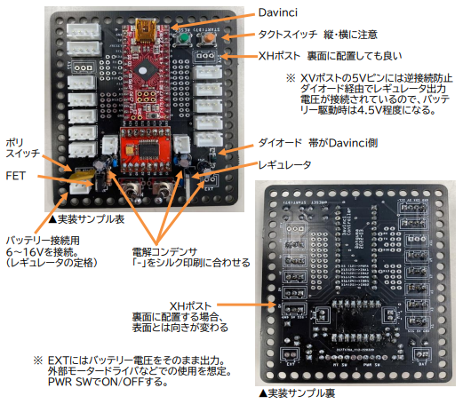
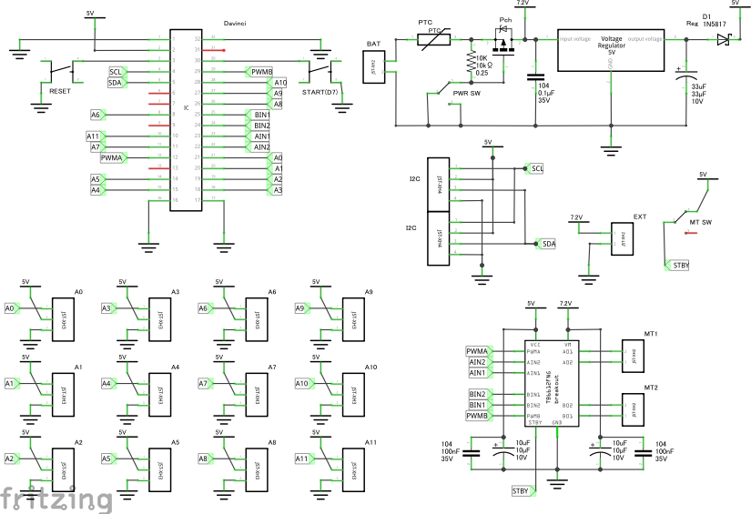
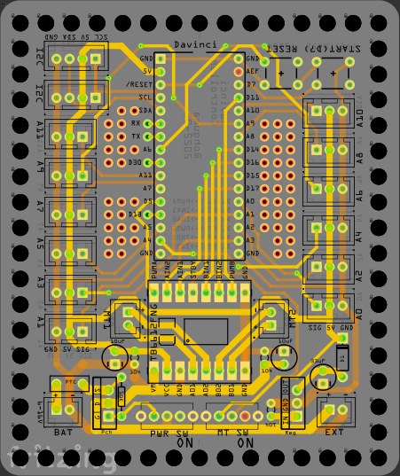
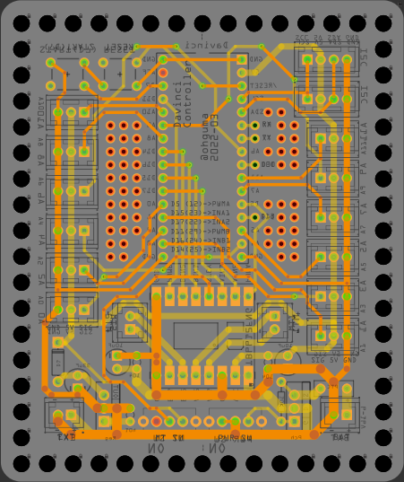

# ストロベリー・リナックス Davinci 拡張基板

## 概要

+ Leonard 互換のストロベリー・リナックス Davinci 基板を拡張して使用するための基板。
  + マイコン　ATMEGA32U4 
  + アナログ入力12本（A0～A11）が利用可能。
  + 1つのタクトスイッチ（D7） はINPUT_PULLUPで利用する。
  + 複数のI2C端子
    + TJ3B互換［SCL,5V,SDA,GND］を2ポート
+ モータードライバ　TB6612FNGを搭載し、モーター2個を制御可能。
  + VM=15V(Max)、1chあたりIout=1.2A(ave)、3.2A(peak)
  + 結線図
    + Davinci：TB6612FNG
    + D15 (23ピン)：AIN1　　A01：MT1 -
    + D17 (22ピン)：AIN2　　A02：MT1 +
    + D5  (12ピン)：PWMA
    + D16 (24ピン)：BIN1　　B01：MT2 +
    + D14 (25ピン)：BIN2　　B02：MT2 - 
    + D11 (29ピン)：PWMB
+ 基板サイズ　78 x 93mm、周囲の穴は3.2mm径、5mm間隔

----

## 実装

----
## パーツ

+ パーツ購入先
  + [ストロベリー・リナックス](http://strawberry-linux.com/)
  + [秋月電子](https://akizukidenshi.com/catalog/)

----
### パーツリスト

個数は明記なければ1個。☆は取り付け向きに注意

+ [ダ・ヴィンチ32U with Arduino Bootloader](http://strawberry-linux.com/catalog/items?code=25005)
+ 入出力 ☆
  - タクトスイッチ　1個（D7用）
  - XH 2ピン用ポスト　任意（バッテリー、モーター2個、バッテリー外部出力(EXT)用）
  - XH 3ピン用ポスト　任意（A0～A11用）
  - XH 4ピン用ポスト　任意（I2C用）
    - XHポストは基板の裏・表どちらに取り付けても良い。裏面設置時は表の時の逆向きになる。

+ モータードライバ関係
  - [SparkFun Motor Driver - Dual TB6612FNG (1A)](https://www.sparkfun.com/products/14451)☆
    - ピン配置が同じ互換モジュールでもよい。
  - 電解コンデンサ 10V 10uF 2個☆
  - セラミックコンデンサ 35V 0.1uF (104） 2個

+ 電源関連 各1個
  - タクトスイッチ　リセット用　1個☆
  - 基板用トグルスイッチ 2個
    - 下記FETとモーター(TB6612FNG)のON/OFF用
  - PchパワーMOSFET（30V40A MTP4835I3等）☆
  - 抵抗 10KΩ（茶黒橙金）
  - ポリスイッチ　　短絡等の保護用。不要時はジャンパ接続する。

+ 内部5V電源まわり
  - ショットキーダイオード （40V1A 1S4など。レギュレータへの逆接防止用）☆
  - 5Vレギュレータ（5V1A TA4805S等）☆
  - 電解コンデンサ 10V 33uF ☆
  - セラミックコンデンサ 35V 0.1uF (104）

----
## 回路図

- モータードライバ周りはデータシートの「Typical Application Diagram」に従った。
  - [SparkFun Motor Driver - Dual TB6612FNG (1A)](https://www.sparkfun.com/products/14451)
  - [TB6612FNG Datasheet](https://www.sparkfun.com/datasheets/Robotics/TB6612FNG.pdf)

----
## 基板作成

+ 基板作成は「[JLCPCB](https://jlcpcb.com/)」を利用した。
  + つや消し黒が安い。
  + 2022-03-19発注、2022-09-29到着、運送便はDHLを選択（配達は直接DHLだった）
  + twitter https://twitter.com/JLCPCB_Japan
+ [Fritzingデータ](./pcb/Davinci_controller_2022.fzz)
  + [Fritzing](https://fritzing.org/)で設計し、基板作成まで行った。
  + コネクタは表・裏どちらにも実装し易いよう、両面にシルクを入れた。
  + 参考書　 「[Fritzing入門実習テキスト「Fritzing Basics」#マッハ新書 （ダウンロード商品）](https://booth.pm/ja/items/1414214)」
+ [発注時ガーバーファイル](./pcb/order_Davinci_controller_2022.zip)
  + 床センサー基板と一体化したデータで発注してしまったため、追加料金を取られた。
  + 同一パターンの面取りは別料金にならないが、異なるパターンをまとめるとNG

 

----
2023-04-05 ohguma